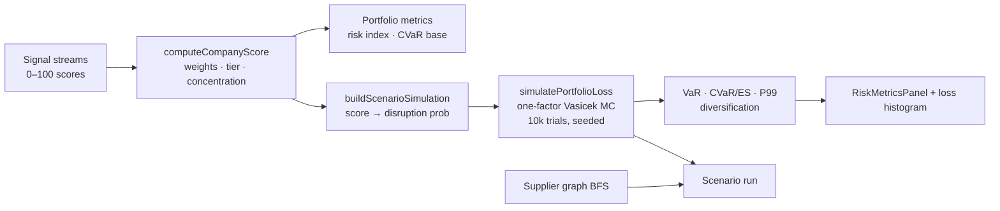

# Ripple architecture

```mermaid
flowchart TB
  subgraph client [Browser]
    UI[Next.js App Router]
    LDP[LiveDataProvider]
  end
  subgraph api [API Routes]
    SNAP[/api/snapshot]
    ING[/api/ingest/run]
  end
  subgraph data [Data layer]
    DS[getDataSource]
    MOCK[Mock store]
    PG[(Postgres + Drizzle)]
  end
  UI --> LDP
  LDP --> SNAP
  SNAP --> DS
  DS --> MOCK
  DS --> PG
  ING --> Pipeline[Ingest pipeline]
  Pipeline --> Normalizer[Normalizer]
  Pipeline --> DS
```

- **UI:** `(dashboard)` route group, client polling via `LiveDataProvider`.
- **API:** `{ asOf, data }` envelope on read routes; rate limiting in middleware.
- **Data:** `DATABASE_URL` selects Postgres; otherwise in-memory mock.
- **Ingest:** Adapter → normalizer → snapshot refresh (placeholders for real keys).

## Risk engine

The quantitative core (`src/lib/risk/`, `src/lib/scenario/`) turns raw signals into scored, tail-risk-quantified output.



- **`normal.ts`** — Φ, Φ⁻¹ (Acklam), erf, analytic Expected Shortfall multipliers.
- **`random.ts`** — seeded mulberry32 PRNG + Box–Muller normals ⇒ reproducible runs.
- **`monte-carlo-engine.ts`** — one-factor Gaussian threshold model (Basel IRB / Vasicek); coherent, sub-additive VaR/CVaR with diversification accounting.
- **Validation** — `npm run evaluate` (Kupiec VaR backtest + property checks); 15 dedicated unit tests. See [docs/EVALUATION.md](./docs/EVALUATION.md) and [docs/RISK_METHODOLOGY.md](./docs/RISK_METHODOLOGY.md).
