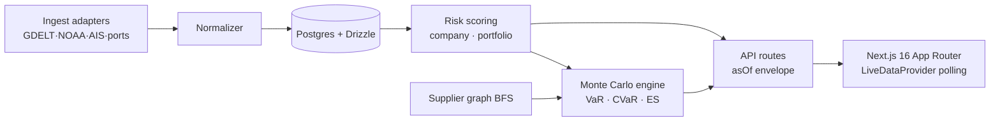

# Ripple

[](https://github.com/omry-b/Ripple/actions/workflows/ci.yml)
[](https://ripple-omry-2596s-projects.vercel.app)
[](https://nextjs.org)
[](https://www.typescriptlang.org/)

**Supply-chain risk intelligence for everyone who can't afford a Bloomberg terminal.**
Live risk signals, company exposure scoring, and Monte Carlo scenario simulation — in one dashboard.

> 🔗 **Live:** [ripple-omry-2596s-projects.vercel.app](https://ripple-omry-2596s-projects.vercel.app) · **Demo data** is seeded automatically; no login required.

---

## The problem

When a port congests, a strait closes, or a fab goes dark, the losses ripple through supplier networks for months. The institutions that can see it coming pay **$25k–$50k per seat per year** for tools like Bloomberg SUPL, Resilinc, or Everstream. Mid-market procurement teams, lenders, and analysts — who face the *same* shocks — are left reading the news.

**Ripple is the thesis of this course made concrete:** one person, with modern AI tooling, building the kind of quantitative risk platform that used to require a desk of engineers and quants. It ingests live geopolitical/logistics/weather signals, scores company and portfolio exposure, and runs a **genuine Monte Carlo tail-risk engine** for "what if" scenarios.

## What it does

| Capability | Where |
|---|---|
| **Your portfolio, your risk** — add the suppliers you depend on, set dollar exposures, and every metric (risk index, CVaR, expected loss) is scoped to *your* book | `/` (My Portfolio) |
| **"What to do today"** — a prioritized action queue ranking your positions by dollars-at-risk, each with a concrete recommended mitigation (effort / cost / impact) | `/` (Priority actions) |
| **Live risk signals** from GDELT, NOAA, AIS, ports & financial feeds (stub→live on API keys) | `/signals` |
| **Company exposure scoring** — weighted signals × tier × supplier concentration, with confidence bands | `/companies`, `/companies/[id]` |
| **Monte Carlo scenario engine** — VaR / CVaR / Expected Shortfall with diversification accounting | `/scenario` |
| **Contagion graph** — BFS over the supplier network to find downstream exposure | `/scenario`, company detail |
| **Alerts, watchlists, webhooks, CSV export, ⌘K search** | throughout |

### From dashboard to decision tool

Ripple's product thesis: a risk score is worthless if it isn't *yours* and doesn't tell you what to *do*. So the experience is built around a personal portfolio —

1. **Add your positions** (suppliers you depend on) and set a dollar exposure for each.
2. **See your risk**, not the world's — the dashboard's risk index, tail-loss (CVaR), expected loss, concentration, and regional mix are all computed over your book using the validated Monte Carlo engine.
3. **Act** — the priority queue ranks your positions by dollars-at-risk and pairs each with a mitigation playbook entry tied to its dominant risk driver.

It works with zero setup (portfolios persist locally; a one-click sample portfolio seeds the experience), so any user reaches personalized value immediately. Logic lives in [`src/lib/portfolio/`](./src/lib/portfolio/) and is unit-tested.

## The risk engine (the technically interesting part)

The scenario engine is **not a decorative chart** — it's a real one-factor Gaussian threshold model, the same structure used in Basel IRB / CreditMetrics:

```
Xᵢ = √ρ·M + √(1−ρ)·Zᵢ ,  M,Zᵢ ~ N(0,1)     M = shared systemic factor (drives contagion)
entity i disrupted ⟺ Xᵢ < Φ⁻¹(pᵢ)          Merton/Vasicek threshold; pᵢ from live risk score
loss = Eᵢ · LGD ,  LGD ~ N(μ,σ)             over 10,000 reproducible (seeded) trials
```

From the simulated loss distribution it reads **Expected Loss**, **VaR**, and **CVaR / Expected Shortfall** — a *coherent, sub-additive* tail measure — plus the **diversification benefit** (portfolio CVaR vs. the sum of standalone CVaRs).

📐 Full math: [docs/RISK_METHODOLOGY.md](./docs/RISK_METHODOLOGY.md) · Code: [`src/lib/risk/`](./src/lib/risk/), [`src/lib/scenario/`](./src/lib/scenario/)

## Evaluation & evidence

The model is **validated like a production risk model**, not just demoed. Run it yourself:

```bash
npm run evaluate   # coherence + convergence + VaR backtest + stress sensitivity
npm run test       # 48 unit tests (15 dedicated to the risk engine)
```

Headline results (full report: [docs/EVALUATION.md](./docs/EVALUATION.md)):

- ✅ **Coherence / sub-additivity** — portfolio CVaR ≤ Σ standalone CVaR (31.8% diversification benefit on the demo book)
- ✅ **Convergence** — Monte Carlo E[L] → analytic expectation within **1.0%** at 50k trials
- ✅ **VaR99 backtest** — **Kupiec POF = 0.954 < 3.841** ⇒ correct coverage not rejected (5 breaches in 750 OOS draws vs. 7.5 expected)
- ✅ **Stress sensitivity** — tail metrics rise with severity, and diversification benefit *shrinks* under stress as correlation clusters losses (an emergent, not hardcoded, behavior)

The harness even **caught a real bug** during development (a sub-additivity violation from a mis-specified standalone CVaR) — documented honestly in the evaluation doc.

## Architecture



Full diagrams: [ARCHITECTURE.md](./ARCHITECTURE.md). `DATABASE_URL` selects Postgres; without it the app runs on an in-memory mock so it works offline.

## Stack

[Next.js 16](https://nextjs.org) (App Router) · TypeScript · Drizzle ORM + Postgres (DigitalOcean) · Firebase auth · Cloudflare Workers (ingest cron) · Vercel · Playwright + Vitest + Storybook.

## Local development

```bash
npm install
npm run dev          # http://localhost:3000  (mock data, no DB needed)
npm run test         # unit tests
npm run evaluate     # risk-model validation report
npm run storybook    # component catalog
npm run test:e2e     # Playwright
```

## Routes

| Path | Description |
|------|-------------|
| `/` | Dashboard overview — risk index, CVaR, hotspot map |
| `/signals` | Live signal streams + drawer detail |
| `/companies`, `/companies/[id]` | Exposure ranking + company profile |
| `/scenario` | Monte Carlo scenario workbench |
| `/welcome`, `/pricing`, `/api-docs`, `/changelog` | Marketing / docs |

OpenAPI JSON: [`/api/openapi`](https://ripple-omry-2596s-projects.vercel.app/api/openapi).
Demo roles: set `DEMO_USER_ROLE` to `viewer` / `analyst` / `admin` in `.env.local`.

## Production setup

Manual steps (credentials, Vercel env, DO Postgres, Cloudflare cron): **[docs/MANUAL_SETUP.md](./docs/MANUAL_SETUP.md)**. Build log: [TODO.md](./TODO.md).

---

## AI tools disclosure

Per the CS 153 AI policy, this project was built with heavy use of AI coding tools, and that use is disclosed in full:

- **[Claude Code](https://claude.com/claude-code) (Anthropic)** — the primary development environment. Used for architecture, full-stack implementation, the risk engine (Monte Carlo model, numerical methods, validation harness), debugging, test authoring, CI configuration, and documentation.
- **Cursor** — secondary editor assistance for quick iteration.

**How to read this honestly:** AI wrote the large majority of the code under my direction. My role was problem definition, architectural decisions, reviewing/correcting model design (e.g. demanding a real Monte Carlo + validation rather than the original placeholder), and verifying correctness. The mathematics in `src/lib/risk/` (one-factor threshold model, Expected Shortfall, Kupiec backtest) was specified and reviewed by me and implemented with AI assistance. All AI-assisted output was tested (`npm run test`, `npm run evaluate`) and is reproducible.

No external repositories were forked; all application code in this repo was written for this project. Third-party libraries are standard npm dependencies listed in `package.json`.
